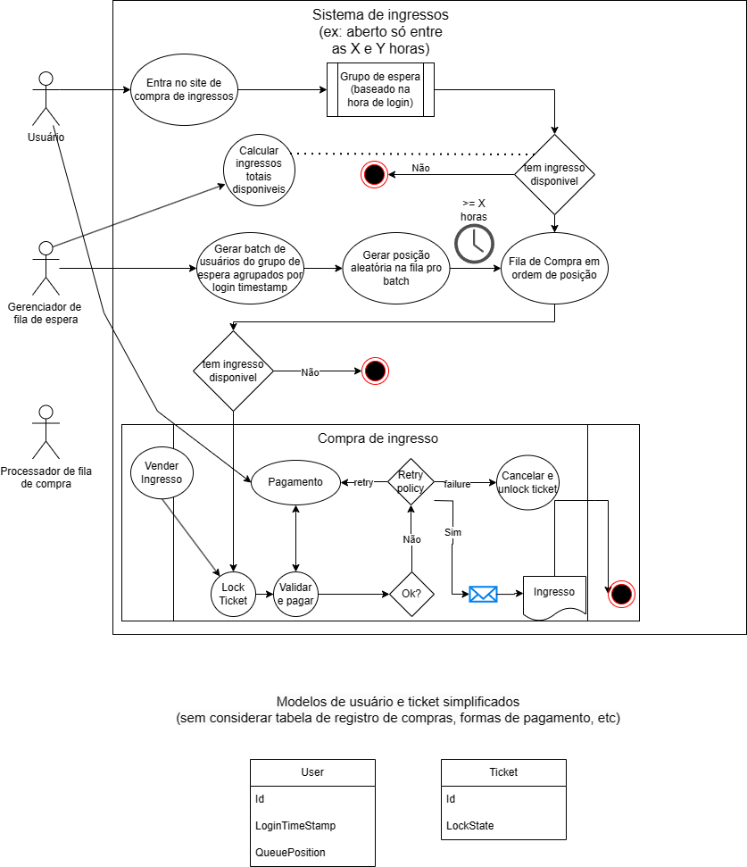

# Ticketing system for Rock in Rio

> A ideia principal é enviar aos usuários para um grupo de espera baseado na hora de login e depois botar-los numa fila em batches baseados na hora de login. Sendo que a posição na fila é aleatória dentro do mesmo batch.

